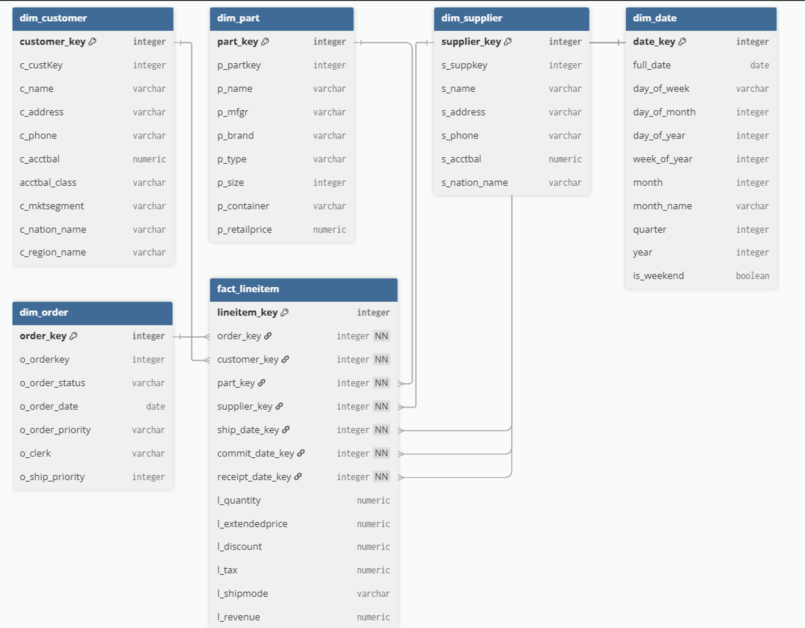

# ETL Star Schema Project – Prospa Data Engineering Challenge  

## Overview  
This project solves the [Prospa Data Engineer interview challenge](https://github.com/prospa-group-oss/interview-test-data-engineer).  

The pipeline:  
1. **Extract** OLTP data from `.tbl` text files.  
2. **Transform** into a **star schema** for OLAP.  
3. **Load** into a SQLite database.  
4. **Query** with analytical SQL queries.  
Built in **Python (pandas + sqlite3)**. 

---

## How It Works  

### **1. Extract**  
- `OLTPLoader` reads `.tbl` files into Pandas DataFrames.  
- Schema applied per table.  
- Includes a `describe_tables()` function for data exploration.  

### **2. Transform**  
- `StarSchemaBuilder` builds dimensions and fact:  
  - `dim_customer` (with account balance classification + nation/region merge)  
  - `dim_part`  
  - `dim_supplier` (nation join)  
  - `dim_order`  
  - `dim_date` (calendar dimension)  
  - `fact_lineitem` (joins surrogate keys, calculates revenue)  

### **3. Load**  
- `LoadOLAPTablesToDatabase` writes dimensions + fact into SQLite (`olap_star_schema.db`).  

### **4. Query**  
- `OLAPQuery` implements analytical queries:  
  - Top 5 nations by revenue  
  - Most common ship mode for top nations  
  - Top 3 selling months  
  - Top customers (by revenue/quantity)  
  - Financial year revenue comparison  

---

## 🖼️ Star Schema Design  

  

- **Fact Table:** `fact_lineitem`  
- **Dimensions:** Customer, Supplier, Part, Order, Date  

---

## Running the Project  

### 1. Clone this repository
git clone https://github.com/masoumezabihi/data_engineering_capstone_project/tree/main/datawarehouse_project<br>
cd datawarehouse_project

### 2. Run the ETL script
The script automatically reads data from the raw_data/ folder and creates a SQLite database:
- python scripts/run_etl.py

### 3. Inspect the generated database
After running the ETL, a database file olap_star_schema.db will be created in the project root.
You can explore the tables using the SQLite command-line interface:
- Open the database: sqlite3 olap_star_schema.db
- List all tables in the database:.tables <br>
You should see the OLAP tables:
- dim_customer, dim_part, dim_supplier, dim_order, dim_date, fact_lineitem

### 4. Example Query Outputs  

After execution, the script prints analytical results directly to the console.  
All query statements are implemented in the `OLAPQuery` class (`scripts/OLAPQuery.py`).  

**Top 5 nations by revenue** 
```
   nation       revenue
0 MIDDLE EAST  359,205.16
1 AFRICA       350,053.73
2 MIDDLE EAST  339,713.20
3 ASIA         335,867.31
4 AFRICA       321,142.63
```
**Most common ship mode for top 5 nations** 
```
most_common_ship_mode
0     TRUCK
```

**Top 3 selling months (by order count)** 
```
  year month_name orders_count
0 1994 March         930
1 1996 October       862
2 1993 December       846
```
**Top customers (by revenue or quantity)** 
```customer_key customer_name
   0 1121      Customer#000001121
   1 645       Customer#000000645
```
**Revenue comparison by financial year**
```
financial_year revenue
0 1991       1.065957e+08
1 1992       1.447356e+08
2 1993       1.651534e+08
3 1994       1.450829e+08
4 1995       1.570654e+08
5 1996       1.610370e+08
6 1997       1.510506e+08
7 1992       1.565555e+08
8 1993       1.609816e+08
9 1994       1.580713e+08
10 1995      1.526817e+08
11 1996      1.566896e+08
12 1997      1.511401e+08
13 1998      7.829449e+07
```

---

## Design & Implementation Notes
### 1. How to schedule this ETL process to run multiple times per day
I would combine the ETL pipeline into a single script and schedule it to run multiple times a day. For a simple setup, this could be done using cron on Linux or Task Scheduler on Windows. In a production environment, I would use an orchestration tool like Apache Airflow, which offers features such as retries, monitoring, and managing dependencies. Cloud-based services like AWS Managed Airflow, GCP Cloud Composer, or Azure Data Factory can also be used to run and monitor workflows reliably at scale.

### 2. Describe how you would deploy your code to production, and allow for future maitenance.
I would deploy the ETL pipeline in a consistent and portable environment using Docker. The pipeline could be scheduled with an orchestrator like Airflow or a cloud service such as AWS Managed Airflow or Azure Data Factory. To keep the project maintainable, I would use Git for version control, include logging and monitoring, and write modular, well-documented code.

To run the pipeline in a container, I would create a Dockerfile that installs Python, copies the project code, and installs dependencies from requirements.txt. Configuration, such as database paths or credentials, would be passed through environment variables to make the setup flexible across environments. The ETL pipeline would be structured so it can be started with a single command (e.g., python run_etl.py), which would also serve as the container’s entrypoint. For data persistence, I would mount volumes or connect to an external database instead of relying only on a local SQLite file. Finally, I would test the Docker image locally and push it to a container registry so it can be deployed and scheduled reliably with tools like Kubernetes, Airflow, or cloud orchestration services.

---

## Bonus Questions  
**1. Customer Account Balance Classification**  
To break customer account balances into three logical groups (Low, Medium, High), I implemented a classification function in the `StarSchemaBuilder` class.  
- Calculated the minimum and maximum account balance from the `customer.tbl` data.  
- Divided the range into three equal intervals.  
- Assigned each customer to one of the three groups based on their `c_acctbal`.  

This classification is stored in a new field called `acctbal_class` in the `dim_customer` table.

**2. Revenue per Line Item**  
To calculate revenue per line item, I added a field `l_revenue` in the `fact_lineitem` table.  
- Computed as: l_revenue = l_extendedprice * (1 - l_discount)<br>
- This allows direct analysis of sales revenue at the line-item level and can be aggregated for customers, products, or periods.  

These enhancements make the star schema more analytical-friendly, enabling quick insights on customer segmentation and revenue analysis.

**3. What about if the data comes from a stream, and arrives at random times?**<br>
Streaming systems handle late-arriving data by using **event-time processing, watermarks, and configurable windowing strategies**. These systems prioritize processing data based on **when events actually occurred (event time)** rather than **when they arrive (processing time)**. To manage delays, they set thresholds for how long to wait for late data and update results incrementally. This ensures accurate outcomes even when data arrives **out of order** or **after initial computations**.
“Streaming systems like Flink or Kafka Streams process data based on event time rather than just arrival time, so they can handle out-of-order or late data. The main tool for this is a **watermark**, which tells the system how far event time has progressed. When the watermark passes a window’s end, results are emitted.
To handle late data, systems allow an **allowed lateness** period, where windows stay open a bit longer. Late events within that period update the results; events arriving after it can be sent to a side output instead of being lost.
Windowing strategies and triggers define when results are fired — for example, when the watermark passes the end, or whenever new late data arrives. To support this, state is retained until the lateness period expires.

