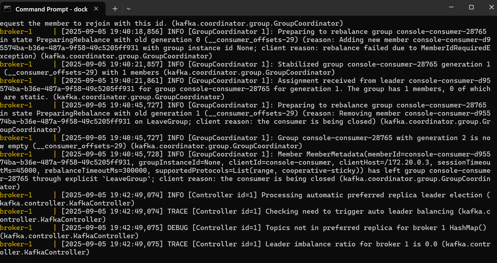
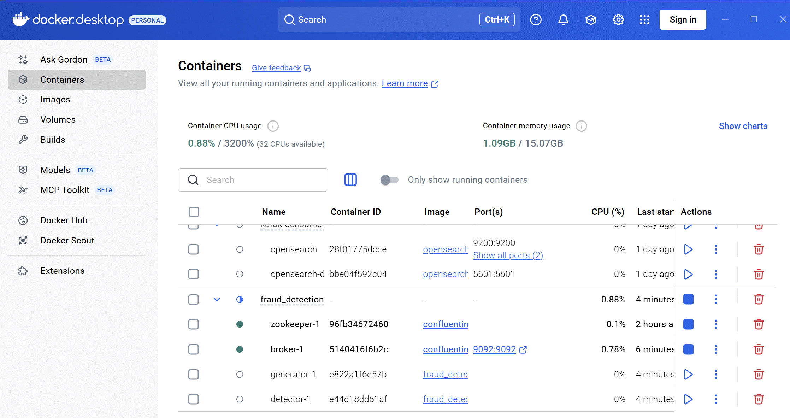
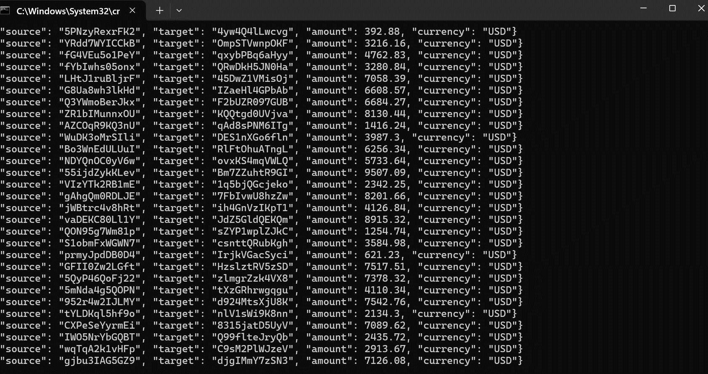
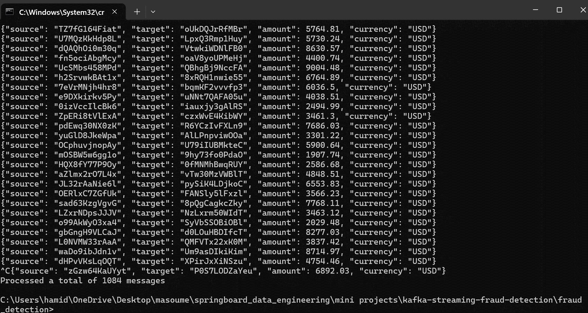
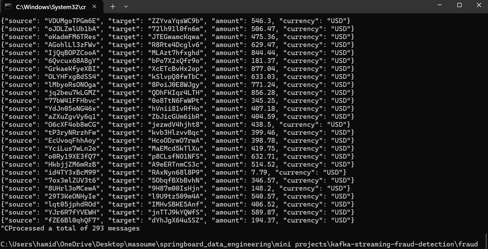

# Kafka Streaming Fraud Detection System
A real-time fraud detection system built using Apache Kafka + Python, running in a containerized environment with Docker & Docker Compose.
This project simulates financial transactions, processes them via Kafka streams, and detects suspicious transactions in real time.

## Project Overview
Fraud detection is a critical use case in financial systems. In this project:
- A Transaction Generator continuously produces fake transactions and pushes them into a Kafka topic.
- A Fraud Detector consumes these transactions, applies a simple fraud detection rule, and routes them into legit or fraud topics.
- The system is fully containerized and orchestrated using Docker Compose.

## Tech Stack
- Apache Kafka (via Confluent Docker images)
- Python 3.6+
- kafka-python client library
- Docker & Docker Compose
## Project Structure

<pre>
  ├── docker-compose.yml
  ├── docker-compose.kafka.yml
  ├── detector
  │   ├── app.py
  │   ├── Dockerfile
  │   └── requirements.txt
  └── generator
      ├── app.py
      ├── transactions.py
      ├── Dockerfile
      └── requirements.txt
</pre>

## Setup Instructions
### Start Kafka Cluster
```bash
docker-compose -f docker-compose.kafka.yml up
```

Verify Kafka broker startup:
``` bash
docker-compose -f docker-compose.kafka.yml logs -f broker | grep started
````
### Start Generator + Detector
```` bash
docker-compose up
````

This will spin up:
- Generator → produces random transactions to queueing.transactions
- Detector → consumes transactions and branches them into:
  - streaming.transactions.legit
  - streaming.transactions.fraud

## Testing
To verify the streams, open a new terminal and run:
````bash
docker-compose -f docker-compose.kafka.yml exec broker \
  kafka-console-consumer --bootstrap-server localhost:9092 \
  --topic streaming.transactions.legit --from-beginning
````
Check fraud transactions:
````bash
docker-compose -f docker-compose.kafka.yml exec broker \
  kafka-console-consumer --bootstrap-server localhost:9092 \
  --topic streaming.transactions.fraud --from-beginning
````

## Screenshots
- Running docker-compose up
  - 
  - 
- Generator
  - 
- Fraud detection results (legit and fraud)
  - transactions:
    - 
  - suspicious transactions:
    - 
