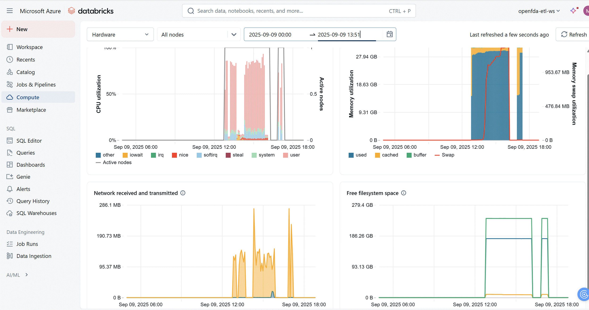

## Monitoring Dashboard (Capstone Final Step) 

### Goal 

To monitor the health and performance of the deployed data pipeline by tracking usage metrics such as compute, memory, storage, and processing time. 

### What Was Attempted 

I attempted to integrate Azure Log Analytics Workspace with Azure Databricks to build a comprehensive monitoring dashboard using Azure Monitor. 
Due to environment restrictions or workspace permission limitations, I was unable to enable full Azure Log Analytics integration within my Databricks workspace.

### What Was Delivered Instead 
I have provided a screenshot of Databricks metrics directly from the Spark UI. This includes key resource usage such as: 
- CPU utilization (broken down by user, system, iowait, etc.)
- Memory utilization (used, cached, buffer, and swap usage)
- Network I/O (bytes received and transmitted)
- Free filesystem space
- Active nodes count 

 
